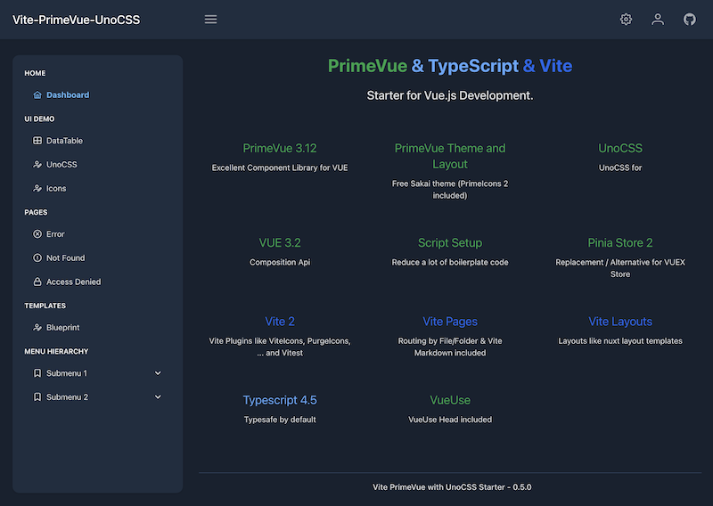

# PrimeVue + UnoCSS Starter

Build your VUE.js App with the latest and fastest VITE Plugins (nuxt.js like)
and first class PrimeVUE support.



[](https://github.com/sfxcode/vite-primevue-starter/actions/workflows/main.yml)

Another starter (but with more complexity) with more vite plugins, i18n, validation examples etc. can be found under [vite-prime-vue-starter](vite-prime-vue-starter.png).

THX to [antfu / Vitesse](https://github.com/antfu/vitesse) for his vite starter code.

## Features

- PrimeVue with Theme: Sakai (Free Admin Template)
- UnoCSS (includes iconify images)
- Vue 3.2 
- TypeScript
- Vite
- Routing with VitePages / ViteLayout
- Vitest (Testing Framework)
- E2E Testing with cypress
- Composition API
- Script Setup
- Pinia as Default Store

### Modules
- logging
- pinia
- primevue

## Project setup and usage

Install node:

**Latest node LTS version required (16)**
Use node manager like **nvm** to install.

Install pnpm:
[https://pnpm.io/installation](https://pnpm.io/installation)

Install dependencies:

```
pnpm install
```

Run development server:

```
pnpm dev
```

Open Cypress test runner:

```
pnpm test:e2e
```

Component test runner:

```
pnpm test:unit
```

Run Cypress tests in headless mode:

```
pnpm test:ci
```

Build and preview built site locally:

```
pnpm preview
```

Build:

```
pnpm build
```

## Tools

I use IntelliJ with VUE.js and Prettier plugin.

## Supporters

JetBrains is supporting this open source project with:

[](http://www.jetbrains.com/idea/)

